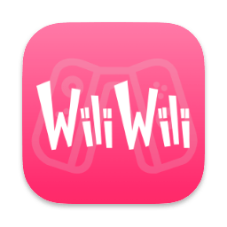

<p align="center">
  
</p>

# wiliwili HD

基于 [wiliwili](https://github.com/xfangfang/wiliwili) v1.6.0 修改的 Windows 版本，
针对 Windows 10/11 平板和二合一设备的触控使用做了若干优化，测试设备为 Surface Go 3。

除下面列出的改动外，其余功能和原版一致，这不是官方版本。
应用配置仍使用原目录 `%LOCALAPPDATA%\xfangfang\wiliwili`，可以和原版共用，但不要和原版同时播放。

## 改动内容

**主页**

- 左侧栏「消息」上方新增两个入口：最小化（回桌面）和退出程序。
- 有视频在后台播放时，这里还会出现「播放器」入口，点击回到播放页，进度和暂停状态保留。
- 快捷键 Ctrl+Shift+Q 可以停止播放并退出。

**播放器**

- 详情页和全屏播放页的控制栏右上角新增「后台浏览」「最小化」「退出程序」，
  控制栏隐藏时轻点画面即可显示。
- 「后台浏览」保留当前视频回到主页，声音继续播放，可以继续搜索、刷新推荐；
  普通的返回或关闭仍然是退出播放。
- 最小化或失焦不会改变播放/暂停状态。最小化时只跳过界面绘制，播放器事件继续处理。
- 支持网页端风格的键盘操作：← / → 后退前进 5 秒，↑ / ↓ 音量，M 静音，F 全屏，
  空格播放暂停，D 弹幕开关，数字键 0~9 跳转进度。焦点停在控制栏按钮上时，
  方向键仍用于切换按钮；触摸和鼠标操作不受影响。

**全屏与窗口**

- Windows 全屏改成不置顶的无边框窗口，取消键盘/手柄模式下的鼠标锁定，
  Alt+Tab、Win+D、任务栏和系统手势都能正常使用。

**搜索**

- Windows 搜索使用系统原生输入框，呼出的是 Windows 触摸键盘，
  可以使用微软拼音的候选字，也支持物理键盘和剪贴板；不再自行启动 OSK 屏幕键盘。

**推荐列表**

- 列表顶部下拉约 144 逻辑像素后松手刷新，回拉到阈值内松手取消，带阻尼和回弹提示；
  鼠标按住左键拖动同样有效，原有的刷新按钮保留。

**方向**

- 页脚新增「旋转 90°」「还原」，并同步变换触摸/鼠标坐标，全屏播放保持所选方向。
- 设置 → 应用 → 窗口中新增「锁定应用方向」开关，默认开启。

**其他**

- 页面切换、失焦、最小化时会取消旧的触摸/鼠标拖动并清理积压事件。
- 修复页面焦点失效、控件重复释放，以及从后台恢复播放器时与主页透明叠加的问题。
- 修复启动过程与打开系统输入框（首页搜索框）时的黑屏闪烁。

更完整的改动记录见 [docs/GO3-WINDOWS.md](docs/GO3-WINDOWS.md)。

## 下载

到 [Releases](../../releases) 下载 `wiliwili-HD-Windows-x64-v1.0.zip`，完整解压后运行
`wiliwili.exe`。不要只复制 EXE，同目录的 DLL 是播放器和网络运行库。
适用于 Windows 10/11 x64，目标电脑不需要安装 MSYS2。

## 构建

仓库中包含补齐的依赖源码。MSYS2 UCRT64 需要 gcc、cmake、ninja、pkgconf、mpv、curl、libwebp。

```powershell
.\scripts\windows\build-go3.ps1 -MsysRoot C:\path\to\msys64 -Jobs 4
```

产物在 `dist` 目录，打包脚本会递归收集 EXE/DLL 依赖并附带许可证和 SHA256 清单。
回归测试源码在 `tests/` 目录。

## 许可证

原项目 [xfangfang/wiliwili](https://github.com/xfangfang/wiliwili) 使用 GPL-3.0，
本项目同样以 GPL-3.0 发布，完整源码在本仓库中，版权归原作者及贡献者所有。
发布包内包含各依赖的许可证文本（`LICENSE` 与 `licenses/`）。

本项目与哔哩哔哩、wiliwili 官方没有关联。
